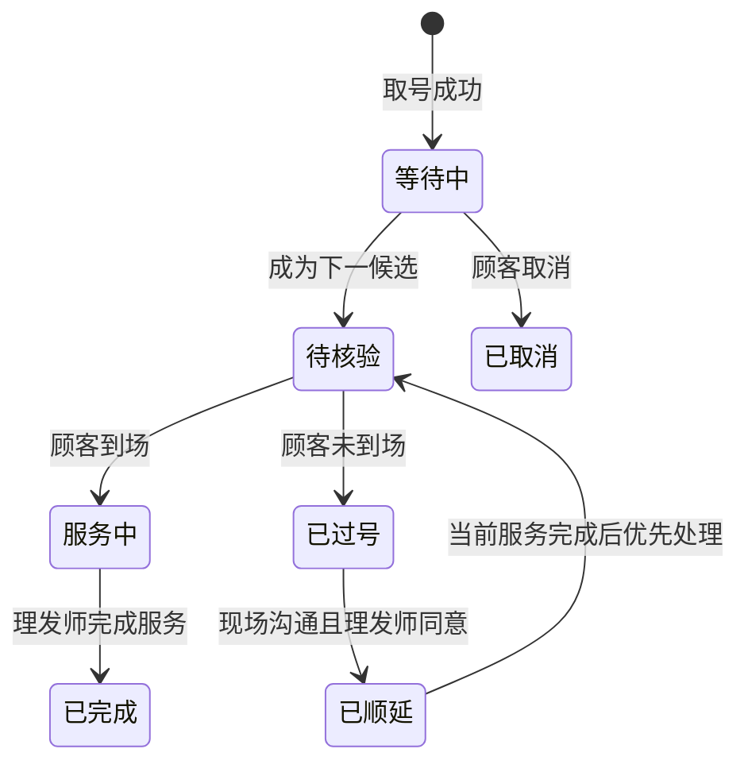

# 服务流程与状态机

```mermaid
stateDiagram-v2
    [*] --> 等待中: 取号成功
    等待中 --> 待核验: 成为下一候选
    待核验 --> 服务中: 顾客到场
    服务中 --> 已完成: 理发师完成服务
    待核验 --> 已过号: 顾客未到场
    已过号 --> 已顺延: 现场沟通且理发师同意
    已顺延 --> 待核验: 当前服务完成后优先处理
    等待中 --> 已取消: 顾客取消
```

确认顺延时，过号号码插入当前“下一位”之后并优先于普通等待队列；多个顺延号码按确认时间排序。完成当前服务后，系统自动展示下一候选号码和取号手机号尾号；队列为空时保持营业但不展示候选。

理发师强制关店会将所有非服务中号码标记为已过号；服务中的号码不允许被强制结束。
